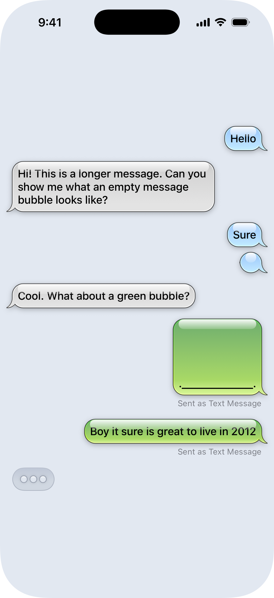

# iOS 6 Message Bubbles in SwiftUI
This is a SwiftUI native recreation of the iMessage/SMS bubble style from the days of yore.

**Components**

1. Fully-responsive/scalable bubble shape recreated as a Swiftui Shape (clamp the minWidth to 32 for best results)
2. Recreated typing indicator
3. Extensions to Color to support colors from iOS 6

This should be plug and play for the most part. Just add the `Components` and `Views` folders to your project.

Developed in Xcode 26 but does not use any iOS 26-specific APIs.

