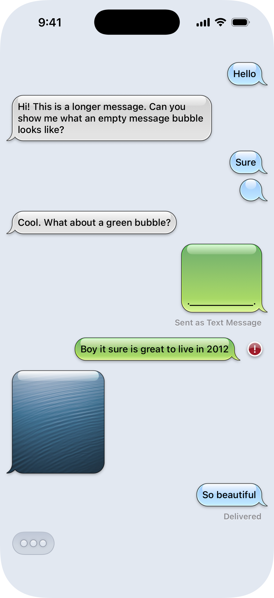

# iOS 6 Message Bubbles in SwiftUI

This is a SwiftUI native recreation of the iMessage/SMS bubble style from the days of yore.

* Fully-responsive/scalable/reversible bubble shape recreated as a Swiftui `Shape()`
* Recreated typing indicator
* Recreated delivery error badge
* Extensions to Color to support colors from iOS 6
* Support for image and text content
* Support for message status text ("Delivered", etc.)
* Support for message delivery errors

# Usage

Add the `Components` and `Views` folders to your project.

## MessageBubble()

`MessageBubble()` has two primary initializers based on whether you want text or image content in the bubble. The `Text` version takes a string that is the message content, and the `Image` version takes an `Image()` view.

Both initalizers otherwise share the following parameters:

* `fromUser`: A boolean indicating whether the message originated from the user.
* `MessageType`: An optional message type that can be either `.iMessage` or `.SMS`. If this parameter is not set, defaults to `.iMessage` (blue bubbles).
* `status`: An optional value for the delivery status of the message. Can be `.delivered` or `.error`. If this parameter is not set, defaults to `nil`.
* `showStatus`: An optional boolean indicating whether the message should display its inline status (for example, iMessages can display "Delivered" and SMS messages can display "Sent as a Text Message"). Use this variable to conditionally set whether the status of the message is visible (for example, to show "Delivered" only for the most recent iMessage). Defaults to `false`.

## BubbleShape()

The `BubbleShape()` is a custom SwiftUI shape that conforms to `InsettableShape()` to fully support `.stroke()`, and `.strokeBorder()`. It is drawn using relative coordinates and should scale properly regardless of content size. 

> [!Tip]
> Use `.frame(minWidth: 32, minHeight: 32)` for empty bubbles to prevent the shape from collapsing on itself.

`BubbleShape()` has one optional parameter, `tail`, used to set the side on which the bubble tail appears, either `.leading` or `.trailing`. If not set, this parameter defaults to `.trailing` (i.e., from the user).

Developed in Xcode 26 but does not use any iOS 26-specific APIs.
